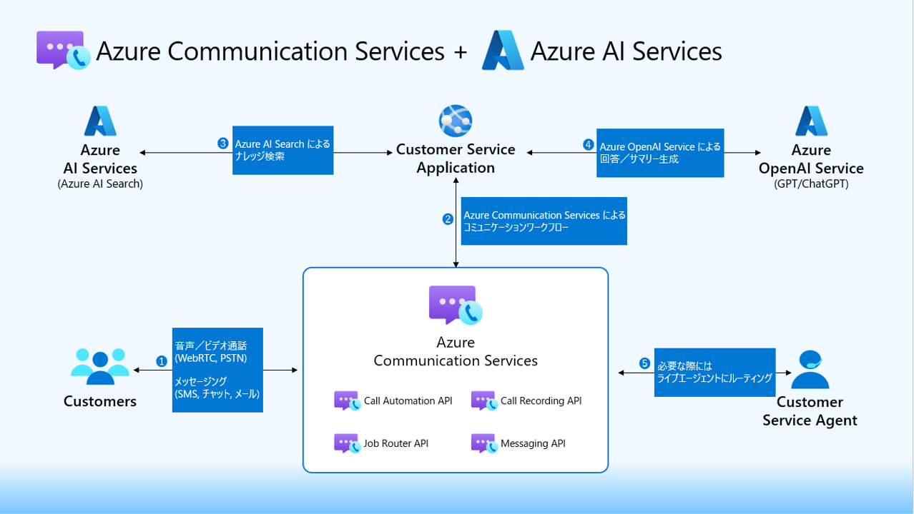
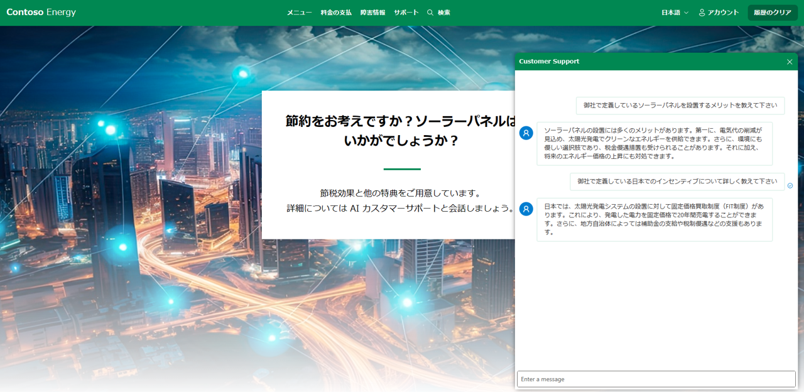
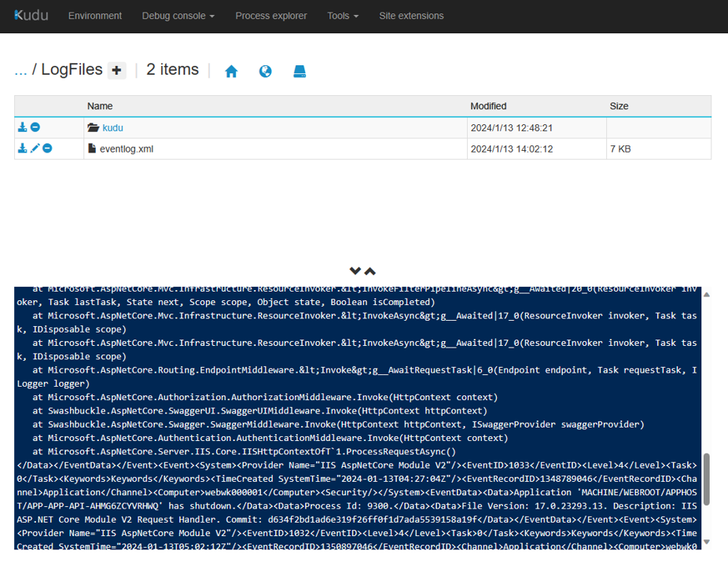

# Azure Communication Services と Azure OpenAI を連携させたカスタマーサポートサンプル
## Webinarの内容
公開後アップデート予定。

以下のコードサンプルでは、Azure Communication Services と Azure OpenAI Service、および Azure AI Services（以前はCognitive Servicesとして知られていました）を組み合わせて、インテリジェントなカスタマーサービスソリューションを作成する方法を学びます。 会社のナレッジと顧客会話データを使用して、質問に答えたり、通話を開始したり、要約を提供したりする自然言語コミュニケーション体験を作成する方法を説明します。

このコードサンプルには、チャットボット、音声ボット、および人間の技術者へのエスカレーションパスを相互作用する顧客とシミュレートするWebアプリが含まれています。架空の会社である Contoso Energy は、グリーンエネルギーと太陽光発電に特化しています。デプロイ手順に従ってアプリをエンドツーエンドで実行し、自分のシナリオとデータに合わせてカスタマイズできます。



## サンプルの実行

### 前提条件
- アクティブなサブスクリプションがある Azure アカウント。詳細については [無料アカウントを作成する](https://aka.ms/Mech-Azureaccount) をご参照下さい。
- [.NET 7](https://dotnet.microsoft.com/download)
- Powershell 7+ (pwsh) - Windows ユーザー
- Azure CLI

## Azure へのデプロイ
- このプロジェクトをクローンします。
- 新規 PowerShell ターミナルを開き `.\start.ps1` を実行します。
    <br />サブスクリプション、リージョン、環境用に簡単な識別名を入力します。
- コマンドで実行される内容:
   - サンプル実行に必要な Azure リソースの作成
   - Bot に参照されるナレッジベースを  `data/` フォルダーにある PDF ファイルを元に Azure AI Search 上でインデックス化
   - サンプルアプリホストの為のフロントエンド／バックエンドアプリケーション
   - Azure Communication Service イベントを受信する EventGrid サブスクリプションをバックエンドアプリケーションをターゲットに登録
- アプリケーションデプロイが完了すると以下フォーマットで URL 情報が出力

出力サンプル:
```
You can view the resources created under the resource group <your rg name> in Azure Portal: https:/portal.azure.com/#@/...

Backend endpoint: https://app-app... 
Frontend endpoint: https://wapp-app-web-...
```
> **Note**<br >
> デプロイには 20~30 分程度を要します。

### デプロイ後の手順
- [Azure Communication Services と Azure AI サービスを接続する](https://learn.microsoft.com/ja-jp/azure/communication-services/concepts/call-automation/azure-communication-services-azure-cognitive-services-integration).
- Communication リソースへの電話番号の追加。 [電話番号の取得と管理](https://learn.microsoft.com/ja-jp/azure/communication-services/quickstarts/telephony/get-phone-number?tabs=windows&pivots=platform-azp).
- メール送信の為に以下をセットアップ
    - [Azure Communication Service でメール通信サービスのリソースを作成して管理する](https://learn.microsoft.com/ja-jp/azure/communication-services/quickstarts/email/create-email-communication-resource)
    - [メール通信サービスに Azure マネージド ドメインを追加する方法](https://learn.microsoft.com/ja-jp/azure/communication-services/quickstarts/email/add-azure-managed-domains) 
- バックエンドアプリケーションの構成をアップデートします。
   - バックエンドアプリケーション用に作成された Azure リソースの環境変数ブレードを開きます。
   - `AcsPhoneNumber` と `EmailSender` 変数を上記手順から取得し入力します。
   - `EmailRecipient` 変数をアプリケーションからメール受信したい任意のメールアドレスを入力します。
   - 忘れず保存を行います。
  
## Application Flow
"Customer Service" ボタンをクリックし、Bot と会話を開始します。



## トラブルシュート
### バックエンドアプリケーションのログ確認
- Azure ポータルを開き、自動作成された `リソースグループ` に移動します。
- バックエンドアプリケーション用に作成された `App Service` リソースに移動します。
- `Advanced Tools > Go > Debug console > PowerShell` に移動します。
- `LogFiles` フォルダに移動します。
- tail -n 100 eventlog.xml
